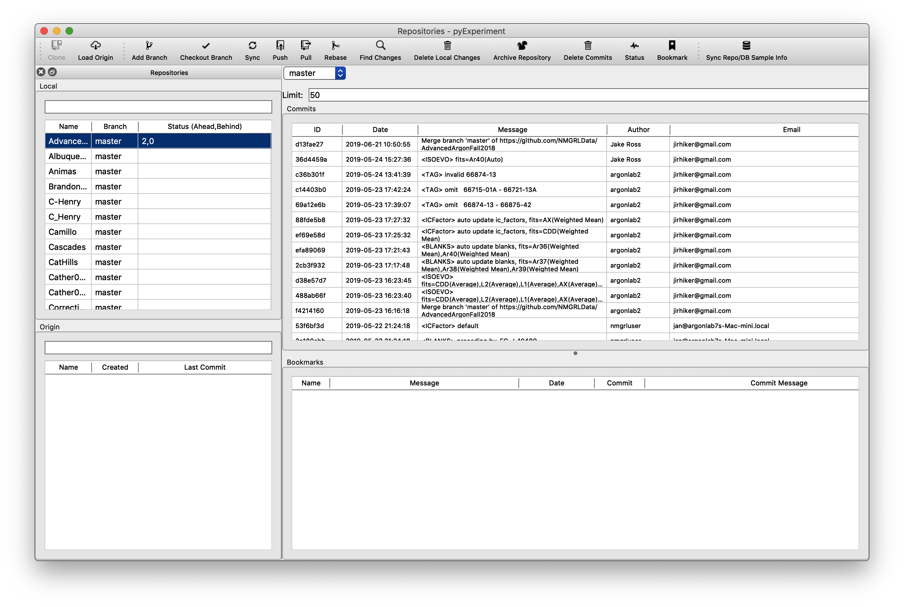

Sharing Changes
=================

Problem. You've made changes on Computer A and want to see those changes on Computer B.

Solution. Share you changes.

Sharing changes is the process of uploading (``push``) your local changes (Data reduction done on Computer A) to
an accessible location (e.i. "The Cloud", GitHub). Once the changes are shared other instances of pychron
will automatically download (``pull``) the changes to the current computer.

How to share changes
---------------------

1. Automatically. If you've made changes and close the Pipeline Window pychron will ask

   "You have changes to analyses. Would you like to share them?"

   There are cases where pychron asks simply

   "Would you like to share your changes?"

   Answering **Yes** to either of these will push (upload) your current changes to ``github
   .com/<your_organizations_data>/<repo>``

2. Manually. Use ``MenuBar/View/Repositories`` to open the window used to interact with pychron's
   data repositories.

.. note::
   Many tasks can be accomplished from the "Repositories" window. For now we will only cover sharing your changes.

1. On the LHS, in the  "Local" group, select a repository from the list.
2. Click "Find Changes" on the toolbar

.. note::
   pychron is examining your local version of the repository and comparing it to the version stored on github.com. The
   results are presented as <Number of changes ahead>, <Number of changes behind>. For example if the repository's
   status is 2,0 then your local version has 2 changes that don't exist in the github.com version. You can "Push" to
   share your 2 changes with github. If the status is 0,3 then your local version is missing 3 changes. You can
   "Pull" to update your version to the github version.

3. Push changes. If your status was X,0 then there is little chance of an issue when pushing. If your status is 0,Y
pushing will do nothing because you have no changes to share. If your status is X,Y the process can get tricky. If
you are comfortable with git proceed with sync, rebase, or via command line. Otherwise contact Pychron Labs.