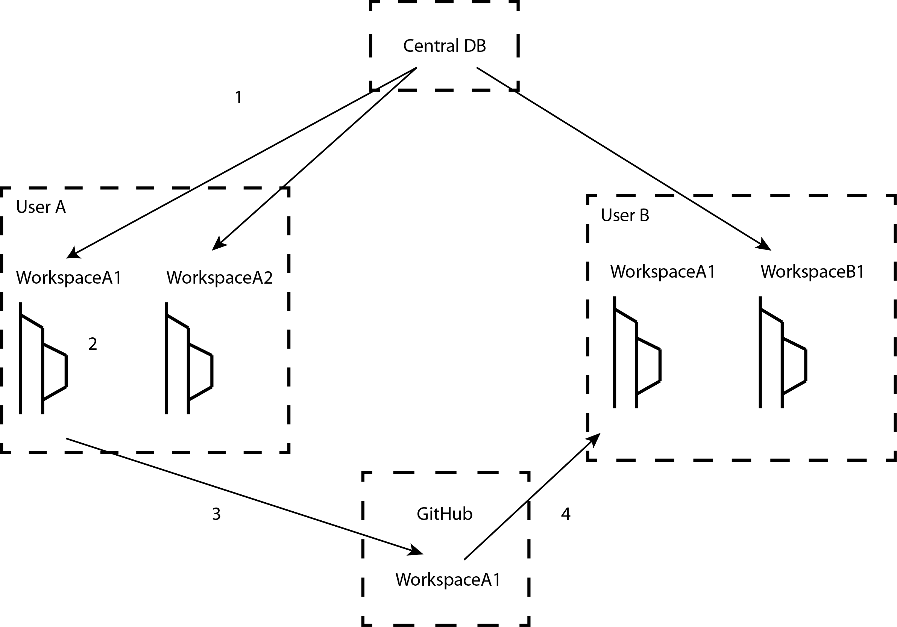

Workspace
-----------

The workspace is an analysis data container. the workspace contains, a MANIFEST file, that lists
all the analyses in the workspace and one file per analysis. The analysis files are in yaml format and
named using the analysis RunID. saving as a yaml file is a convienent way to parse analysis files. Each
workspace is a git repository, allowing branching and fine-grained version control.

The first step after creating a workspace is to load analyses into it. This process is called "checking out" in
pychron. The user selects a set of analyses using the browser and for each analysis pychron extracts the analytical data
from the central mysql database and saves it to the workspace directory as a yaml file.

By default the workspace comes with to branches: master and develop. Checking out of analyses happens on the master
branch (changes are automatically merged into develop). Data processing changes are committed on develop. To share
the changes, merge develop into master and commit to a public host repo (e.g. GitHub).

1. Checkout analyses to User A's workspace
2. Do data reduction
3. Push changes to GitHub
4. Pull changes to User B's workspace